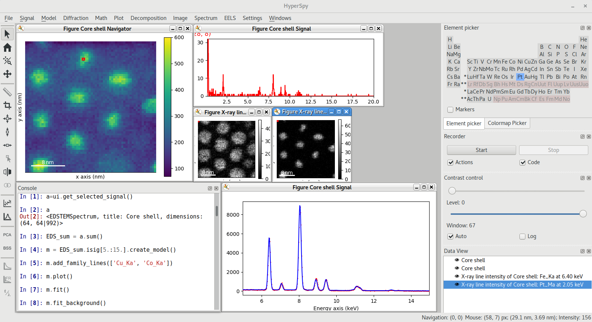

.. toctree::
  :hidden:

  User Guide <user_guide>
  Release Notes <changes>
  Reference <api/modules.rst>
  Contribute <dev_guide>

HyperSpyUI - A Graphical interface for HyperSpy
==================================================

HyperSpyUI tries to bring a streamlined user interface to the powerful
multi-dimensional analysis capabilities of `HyperSpy`_. HyperSpy is an
open source Python library which provides tools to facilitate
data analysis of multidimensional datasets.

HyperSpy aims at making it easy and natural to apply analytical procedures
that operate on an individual signal to multidimensional arrays, as well as
providing easy access to analytical tools that exploit the multidimensionality
of the dataset.

While the UI tries to create a simple and intuitive interface to HyperSpy,
it still retains the raw power of HyperSpy via the UI's built in `IPython`_
console. As HyperSpyUI is made in Python, the same programming language
as HyperSpy, the integration is seamless.

   Screenshot of HyperSpyUI performing quantification by curve fitting of an
   EDS dataset of FePt core-shell nanoparticles. The embedded IPython console
   (bottom-left) enables interactive Python scripting.

.. _HyperSpy: https://hyperspy.org
.. _IPython: https://ipython.org

Learning resources
------------------

.. grid:: 1 3 3 3
  :gutter: 2

  .. grid-item-card::
    :link: quickstart
    :link-type: doc

    :octicon:`rocket;2em;sd-text-info` Getting Started
    ^^^

    New to HyperSpy or Python? The getting started guide provides an
    introduction on basic usage of HyperSpyUI and how to install it.

  .. grid-item-card::
    :link: user_guide
    :link-type: doc

    :octicon:`book;2em;sd-text-info` User Guide
    ^^^

    The user guide provides in-depth information on key concepts of HyperSpyUI
    and how to use it along with background information and explanations.

  .. grid-item-card::
    :link: api/modules
    :link-type: doc

    :octicon:`code-square;2em;sd-text-info` Reference
    ^^^

    Documentationof the Application Progamming Interface (API), which describe
    how HyperSpyUI functions work and which parameters can be used.

Development status
------------------

Currently, the development of HyperSpyUI is focused on strengthening its
back-bone and making sure that it is as easy as possible to add new features
to the UI. There is also an ongoing efort to add easy, intuitive access
to as many of HyperSpy's features as possible.

HyperSpy itself is stated to be in a "perpetual beta". As such, the UI will
never be more stable than the underlying drivetrain, however, that should only
affect the analytical capabilities. The application itself is based on the
mature Qt framework, and should therefore be robust.
