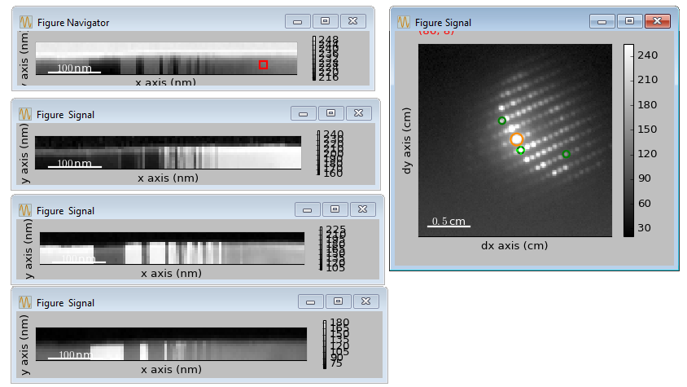

.. _actions:

Available actions
=================

Most menu entries and toolbar buttons trigger an `action` when clicked. This
is a rather loose definition, but actions are different from 
:ref:`tools-section` and :ref:`widgets-section`.

The list below is sorted on category, which roughly corresponds to the
toolbar/menu in which they appear.

.. TODO - Write a sphinx extension to scrape the icons of the actions
.. Format something like: :hui:icon:`<action key>` width: 22 px

File
-----------------

Open
"""""""""""""""""""
Open a dialog to let the user interactively browse for files. It then loads
these files using :py:meth:`hyperspy.io.load` before plotting the loaded
signals.

Open Stack
""""""""""""""""""""""""""""""""""""
Open files and combine the loaded signals into one signal (stacked).

Close
""""""""""""""""""""""""""""""""""""
Close the selected signal(s).

Save
""""""""""""""""""""""""""""""""""""
Save the selected signal(s).

Save figure
"""""""""""""""
Save the currently active figure using matplotlib's
:py:meth:`~matplotlib.figure.Figure.savefig`. Note that this does not care 
about how the figure was produced, or the underlying resolution of the data.

New editor
""""""""""""""""""""""""""""""""""""
Opens a new :ref:`code-editor`.

.. _close-all:

Close All (signals)
""""""""""""""""""""""""""""""""""""
Close all signals. This can sometimes help clear out signals that get stuck
in an invalid state.

Exit
"""""""""""""""
Close the application.

Signal
-----------------

.. _signal-type:

Signal type
"""""""""""""""
Changes the signal type using a combination of methods on
:py:class:`hyperspy.Signal`:

    * :py:meth:`~hyperspy.Signal.set_signal_type()`
    * :py:meth:`~hyperspy.Signal.set_signal_origin()`
    * and by converting with :py:meth:`~hyperspy.Signal.as_image()` and
      :py:meth:`~hyperspy.Signal.as_spectrum()`.

Signal data type
""""""""""""""""""""""""""""""""""""
Change the data type use to store the signal data internally. See
:ref:`numpy:data-type-objects-dtype`. The operation is performed by 
:py:meth:`hyperspy.signal.Signal.change_dtype`.

Manual align
""""""""""""""""""""""""""""""""""""
Interactively align the signal. Navigate through the signal stack, and shift
each point individually. This will also shift all the following points by the
same amount. During input, the images are simply looped around the edges, but
for final processing the signal dimensions will be expanded to fit the aligned
signal.

Statistics
""""""""""""""""""""""""""""""""""""
Print the signal statistics to the console. See 
:py:meth:`hyperspy.signal.Signal.print_summary_statistics` for details.

Histogram
""""""""""""""""""""""""""""""""""""
Plot a histogram of the signal. See 
:py:meth:`hyperspy.signal.Signal.get_histogram` for details. The method
for determining the number of bins can be set in the :ref:`settings-section`.

Mirror navigation
""""""""""""""""""""""""""""""""""""
Mirror navigation axes of selected signals, `i.e.` they will always navigate
together.

Share navigation
""""""""""""""""""""""""""""""""""""
Mirror navigation axes of selected signals, and keep only one navigator
plot.

Rebin
""""""""""""""""""""""""""""""""""""
Opens a dialog to rebin the signal. See
:py:meth:`hyperspy.signal.Signal.rebin` for details.

Model
-----------------

Create Model
"""""""""""""""
Add and plot a default model for the selected signal. Note that the
:ref:`signal-type` is important in order to create the correct model type.

The newly created model is accessible through the :ref:`data-widget`.

Add component
""""""""""""""""""""""""""""""""""""
Add a component to the currently selected model.

The newly created component is accessible through the :ref:`data-widget`.

Plot components
"""""""""""""""
Toggle the plotting of each component together with the model, as performed
by :py:meth:`hyprespy.Model1D.enable_plot_components()`.

Adjust component positions
""""""""""""""""""""""""""
Add/remove widgets to adjust the position of the components in the model, as
performed by :py:meth:`hyprespy.Model1D.enable_adjust_position()`.

Decomposition
-----------------

PCA
"""""""""""""""
Performs decomposition if neccessary, then plots the scree for selecting the
number of components to use for a decomposition model. The selection is made
by clicking on the in the scree plot on the first component to
`not be included` in the decomposition. The scree plot will then automatically
close and the decomposition model plotted (see
:py:meth:`hyperspy.Signal.decomposition` and
:py:meth:`hyperspy.Signal.get_decomposition_model`).

BSS
"""""""""""""""

Performs decomposition if neccessary, then plots the scree for selecting the
number of components to use for a blind source separation. The selection
is made by clicking in the scree plot on the first component to
`not be included` in the decomposition. The scree plot will then automatically
close and the BSS algortihm run (see
:py:meth:`hyperspy.Signal.blind_source_separation` and
:py:meth:`hyperspy.Signal.plot_bss_results`).

Decomposition results
"""""""""""""""""""""

Performs decomposition if necessary, then plots the decomposition results
according to the hyperspy's
:py:meth:`hyperspy.Signal.plot_decomposition_results`.

Spectrum
-----------------

Smooth Savitzky-Golay
""""""""""""""""""""""""""""""""""""
Apply a Savitzky-Golay filter. See
:py:meth:`hyperspy.signal.Signal.smooth_savitzky_golay` for details.

Smooth Lowess
""""""""""""""""""""""""""""""""""""
Apply a Lowess smoothing filter. See
:py:meth:`hyperspy.signal.Signal.smooth_lowess` for details.

Smooth Total variation
""""""""""""""""""""""""""""""""""""
Total variation data smoothing. See
:py:meth:`hyperspy.signal.Signal.smooth_tv` for details.

Butterworth filter
""""""""""""""""""""""""""""""""""""
Apply a Butterworth filter. See
:py:meth:`hyperspy.signal.Signal.filter_butterworth` for details.

Hanning taper
""""""""""""""""""""""""""""""""""""
Apply a Hanning taper to both ends of the data. See
:py:meth:`hyperspy.signal.Signal.hanning_taper` for details.

EELS
-----------------

Remove Background
""""""""""""""""""""""""""""""""""""
Interactively define the background, and remove it. See
:py:meth:`hyperspy.signal.Signal.hanning_taper` for details.

Fourier Ratio Deconvoloution
""""""""""""""""""""""""""""""""""""
Use the Fourier-Ratio method to deconvolve one signal from another.

.. note::
    
    The background should be removed with e.g. `Remove Background`_ before
    running Fourier ratio deconvolution.

See :py:meth:`hyperspy.signals.EELSSpectrum.fourier_ratio_deconvolution` 
for details. 

Estimate thickness
""""""""""""""""""""""""""""""""""""
Estimates the thickness (relative to the mean free path) of a sample using 
the log-ratio method. See 
:py:meth:`hyperspy.signals.EELSSpectrum.estimate_thickness` for details.

Browse EELSDB
""""""""""""""""""""""""""""""""""""
Browse the EELSDB_ online database of standard EEL spectra.

.. _EELSDB: http://eelsdb.eu

Image
-----------------

Gaussian Filter
""""""""""""""""""""""""""""""""""""
Opens a dialog to interactively apply a gaussian smoothing filter.

Rotate
""""""""""""""""""""""""""""""""""""
Opens a dialog to interactively rotate an image. Works on images in both
navigation and signal space.

Diffraction
-----------------

Virtual aperture
""""""""""""""""""""""""""""""""""""
Add a virtual aperture to the diffraction image. The aperture can be moved
around and resized, allowing for an interactive creation of virtual BF/DF
images.

Virtual navigator
""""""""""""""""""""""""""""""""""""
Set the navigator intensity by a virtual aperture.

.. note:: 
    Setting a virtual navigator will replot the signal, so any existing 
    apertures will be lost. Therefore always add the virtual navigator first
    if you want to use one.

    Example of a signal with a virtual navigator and three virtual apertures.
    The navigator (orange circle) selects the direct beam, giving a virtual 
    bright-field image, while the other apertures select diffraction spots
    unique to three different grains/phases.

Math
-----------------

Mean
""""""""""""""""""""""""""""""""""""
Plot the mean of the current signal.

Sum
""""""""""""""""""""""""""""""""""""
Plot the sum of the current signal.

Maximum
""""""""""""""""""""""""""""""""""""
Plot the maximum of the current signal.

Minimum
""""""""""""""""""""""""""""""""""""
Plot the sum of the current signal.

Std.dev.
""""""""""""""""""""""""""""""""""""
Plot the standard deviation of the current signal.

Variance
""""""""""""""""""""""""""""""""""""
Plot the variances of the current signal.

FFT
""""""""""""""""""""""""""""""""""""
Perform a fast fourier transform on the active part of the signal.

Live FFT
"""""""""""""""
Perform a fast fourier transform on the active part of the signal. The live
FFT updates the FFT as the signal is navigated.

Signal FFT
""""""""""""""""""""""""""""""""""""
Perform a fast fourier transform on the entire signal, not just the active
part.

Inverse FFT
""""""""""""""""""""""""""""""""""""
Perform an inverse fast fourier transform on the active part of the signal.

Inverse Signal FFT
""""""""""""""""""""""""""""""""""""
Perform an inverse fast fourier transform on the entire signal.

Plot
---------------

Tight layout
""""""""""""""""""""""""""""""""""""
Apply a tight layout to the selected plot.

Settings
-----------------

Version selector
""""""""""""""""""""""""""""""""""""
Open dialog to select branch/version of HyperSpy/HyperSpyUI.

Check for updates
""""""""""""""""""
Checks for updates to HyperSpy and HyperSpyUI. If the packages are not source
installs, it checks for a new version on `PyPI`_.

Plugin manager
""""""""""""""""""""""""""""""""""""
Show the plugin manager.

Reset layout
""""""""""""""""""""""""""""""""""""
Resets layout of toolbars and widgets.

HyperSpy settings
""""""""""""""""""""""""""""""""""""
Edit the HyperSpy package settings.

Edit settings
"""""""""""""""
Shows a dialog for editing the application and plugins settings.

Windows
-----------------

Tile
""""""""""""""""""""""""""""""""""""
Arranges all figures in a tile pattern.

Cascade
""""""""""""""""""""""""""""""""""""
Arranges all figures in a cascade pattern.

Close all (windows)
""""""""""""""""""""""""""""""""""""
Closes all matplotlib figures.

