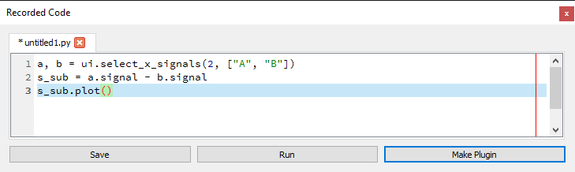
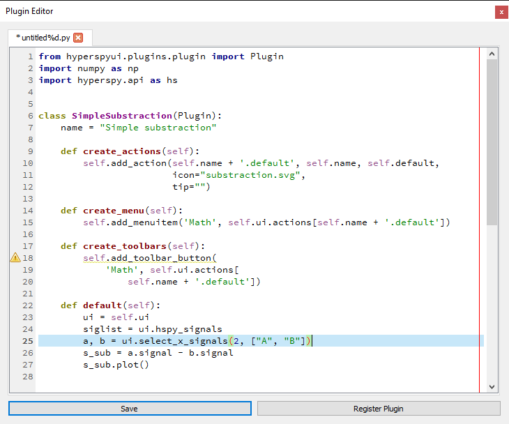

Developer guide
===============

This guide is intended for anyone that wants to write code that interacts
with the UI. This can be relevant for tasks from gaining access to the loaded
signals in the console, to writing plugins that extended the functionality of
the UI.

One of the main components of the API is the
:py:class:`~hyperspyui.mainwindow.MainWindow` class. This is the class of
the main UI window, and can be considered the hub to reach all the loaded
content, including signals and models, or :ref:`actions`,
:ref:`widgets-section` and :ref:`tools-section`.

.. _console:

Internal Console
----------------

The internal console is a qtconsole_ widget running IPython_, and can
run any code that IPython can. To facilitate the typical use of the console,
numpy_ is pre-loaded as ``np``, and :py:mod:`hyperspy.api` as ``hs``. The current
:py:class:`~hyperspyui.mainwindow.MainWindow` instance is also exported as
``ui``, and the list of currently loaded hyperspy
:py:class:`~hyperspy.signals.Signal` instances is exported as ``siglist``.

.. _qtconsole: https://qtconsole.readthedocs.io/en/stable/
.. _IPython: http://ipython.org/
.. _numpy: http://www.numpy.org/

If we want to inspect the original metadata of the currently selected signal,
we can then run:

.. sourcecode:: ipython

    In [1]: s = ui.get_selected_signal()

    In [2]: s.original_metadata
    Out[2]:
    ├── DATATYPE = Y
    ├── FORMAT = EMSA/MAS Spectral Data File
    ├── NCOLUMNS = 1.0
    ├── NPOINTS = 2048.0
    ├── OFFSET = 360.0
    ├── OWNER =
    ├── SIGNALTYPE = ELS
    ├── TITLE =
    ├── VERSION = 1.0
    ├── XPERCHAN = 0.2
    ├── XUNITS = eV
    └── YUNITS = Counts

.. _code-editor:

Code editor widget
------------------

Code editor widgets allow you to edit Python code directly within the
application. This can be useful for :ref:`recording`, or for creating
and modifying :ref:`plugins-section` on the fly. An editor widget is opened
by the :ref:`new-editor` action, when a python script is opened,
or when recording is started via the :ref:`recorder-widget`.

.. _recording:

Recording code
------------------

Most if not all actions that the UI perform can be recorded. To start
recording, press the 'Start' button in the :ref:`recorder-widget`. This will
open up a new blank :ref:`code-editor`, that will be populated with code
as actions are performed. The code can be edited while recording; the new
code is simply appended at the end. Closing the widget will automatically
stop the recording, but stopping the recording will leave the editor open.

One of the most useful ways to use the recorder, is to perform an action on
one signal, and then select another signal and perform those same actions
on it as well. This can be very useful if you `e.g.` need to crop both a
core-loss and a low-loss spectrum, as they will be cropped to exactly the
same region.

.. note::
    While most of the code that is recorded tries to infer as much about its
    context as possible, it is not magical, so some manual adaptation of
    the recorded code might be needed. Typically, signal names need to be
    adjusted so that the right signals are used for different steps in a
    multi-step process.

.. _plugins-section:

Plugins
------------------

Once a sequence of steps have been recorded and adjusted, it can be saved as
a python script which can then be loaded later for future use. However, if
this is something that is used often, and does not change from session to
session, this might become rather cumbersome. The easiest step then is to turn
the code into a UI action, either as a menu item, or toolbar button. This is
done by creating a new plugin. To ease the creation of a plugin, the
:ref:`code-editor` has a button 'Make Plugin'.

For example, here we've created a rather simple exmple for code to
substract one signal from another (a little naive, as it doesn't take data
type into account):

Raw code::

    a, b = ui.select_x_signals(2, ['A', 'B'])
    s_sub = a.signal - b.signal
    s_sub.plot()

In editor:

Clicking the 'Make plugin' button, we're presented with a dialog, asking
what the plugin should be called, whether we want to add it as a menu
entry and/or toolbar button, which catgory it should go in (read: which menu
and toolbar it goes into), and if it should have an icon (recommended for
toolbar buttons):

.. image:: plugin_wizard.png

After deciding what we want, we click 'OK', and a new editor appears with the
following code:

Raw code::

    from hyperspyui.plugins.plugin import Plugin
    import numpy as np
    import hyperspy.api as hs

    class SimpleSubstraction(Plugin):
        name = "Simple substraction"

        def create_actions(self):
            self.add_action(self.name + '.default', self.name, self.default,
                            icon="substraction.svg",
                            tip="")

        def create_menu(self):
            self.add_menuitem('Math', self.ui.actions[self.name + '.default'])

        def create_toolbars(self):
            self.add_toolbar_button(
                'Math', self.ui.actions[
                    self.name + '.default'])

        def default(self):
            ui = self.ui
            siglist = ui.hspy_signals
            a, b = ui.select_x_signals(2, ['A', 'B'])
            s_sub = a.signal - b.signal
            s_sub.plot()

In editor:

As can be seen, it has created a bare-bones plugin class, with a single action
called ``default``. It also imports hyperspy and numpy, and sets the
variables ``ui`` and ``siglist`` such that the code works directly as in the
console. Our action is crated in
:py:meth:`~hyperspyui.plugins.plugin.Plugin.create_actions`,
added as a menu item in
:py:meth:`~hyperspyui.plugins.plugin.Plugin.create_menu`,
and as a toolbar button in
:py:meth:`~hyperspyui.plugins.plugin.Plugin.create_toolbars`.

So now that we have the code for a plugin, all that remains is to register it.
This we do by clicking the button 'Register Plugin' which has now replaced the
buttons 'Run' and 'Make Plugin' (since they don't make sense for a plugin).
Now, as we have yet to save our code, we will at this point be asked to save
the plugin script, as only saved files can be loaded as plugins. If we only
want this plugin for the current session, we can save it anywhere. The next
time we start the application, it will then not be loaded unless we manually
register it again. However, if we want it to be loaded automatically every
time we start the application, we need to save it in the 'plugins' directory
(default location when the 'Register Plugin' button is pressed).

.. note::
    If you are on the development version of HyperSpyUI, and don't want to
    commit your plugin, you can also save it to the sub folder
    'user_plugins', which is added to the .gitignore file.

Once the plugin has been registered, it will automatically be loaded, and so
we should directly be able to find our new menu entry like this:

.. image:: plugin_menu.png

.. _plugin-manager-widget:

Plugin manager widget
---------------------

The plugin manager widget shows a list of all the discovered plugins
(and any that have been added manually), their locations, and allows
to set whether they should be loaded or not. There's also an 'Edit' button
which will open up the source code of the plugin in a new :ref:`code-editor`.

Unchecking a plugin will attempt to unload it, but the success of this
depends on the plugin correctly implementing its
:py:meth:`~hyperspyui.plugins.plugin.Plugin.unload` routine, which might not always
be the case.

.. note::
    The unloading will only be partial if references to its content
    remain elsewhere in the program, so for this reason many core plugins will
    fail to unload fully.
