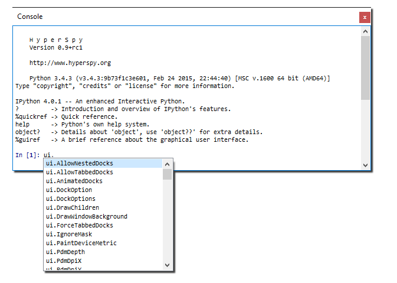

.. _widgets-section:

Widgets
============

.. _data-widget:

Data view
------------------

The data tree widget is a core component of the UI, as it lists all the
currently loaded signals and models. It can also be used to achieve some
common tasks such as replotting the signal/model, closing a signal, deleting
a model, and hiding/showing all the plots of a signal. While useful for
normal signals, it is almost a necessity for managing models and their
components. Each model and component are listed hierarchically in the tree
view, and clicking the components shows an editor for manipulating the
parameters of the component. Right clicking on the different models and
components also allows acces to some actions that are unavailable elsewhere.

For all models:

    Plot
        Plot the model, or replot it if already plotted.
    Fit
        Fit the currently active spectrum
    Multifit
        Fit all the spectra in the current signal
    Set signal range
        Constrict the signal range used for the fitting routines
    Delete
        Delete the model
    Add component
        Adds a component of the given type to the model

Additional actions for :py:class:`hyperspy.models.EELSModel`:

    Set low-loss
        Specify the corresponding low-loss signal for a core-loss signal.
    Enable fine structure
        See :py:meth:`hyperspy.models.EELSModel.enable_fine_structure` for
        details on what this does.

Element picker
---------------------

The element picker is a miniature periodic table. If an
:py:class:`~hyperspy.signals.EDSSpectrum` or
:py:class:`~hyperspy.signals.EELSSpectrum` is selected it can be used to add
elements to the signal. For EDS spectra, right clicking on the elements
will allow the selection of specific xray lines to add. The different EDX lines
can be indicated on the plot by checking the 'Markers' checkbox, and
integrated intensity maps of the α-lines can be created by clicking the 'Maps'
button (see :py:class:`~hyperspy.signals.EDSSpectrum.get_lines_intensity`
for details).

.. image:: element_picker.png

Contrast control
---------------------

A :py:class:`~hyperspyui.widgets.contrastwidget.ContrastWidget`
type widget for adjusting the contrast response of image plots. The 'Level'
slider specifies the lower cut-off intensity, and the 'Window' slider controls
the width of the intensity window starting at ``level``. The 'Auto' option
uses the automatic settings of :py:class:`hyperspy.drawing.image.ImagePlot`.

By selecting 'Log' a logarithmic transform is applied to the image cotrast.
This only affects the plot, and leaves the data untouched.

.. image:: contrast_control.png

Colormap picker
---------------------

A :py:class:`~hyperspyui.plugins.cmappicker.CMapPickerWidget` type widget for
changing the colormap of image plots. The dropdown shows all the colormaps
available in matplotlib, grouped by category. It also shows a preview of
the colorscale alongside the name.

.. image:: colormap_picker.png

Axes configuration
---------------------

Axes order
---------------------

.. _recorder-widget:

Recorder widget
------------------

The record widget offers controls to turn on or off recording to a dedicated
:ref:`code-editor`. Two checkboxes allow for selecting what should be recorded.
See :ref:`recording` for details on what is recorded, and how it can be used.

.. image:: recorder_widget.png

.. _console-widget:

Console widget
------------------

The console widget is a `qtconsole`_ console widget running `IPython`_, and can
run any code that IPython can. For details on how to successfully use it, see
the :ref:`console` section.

.. _qtconsole: https://qtconsole.readthedocs.io/en/stable/
.. _IPython: http://ipython.org/

